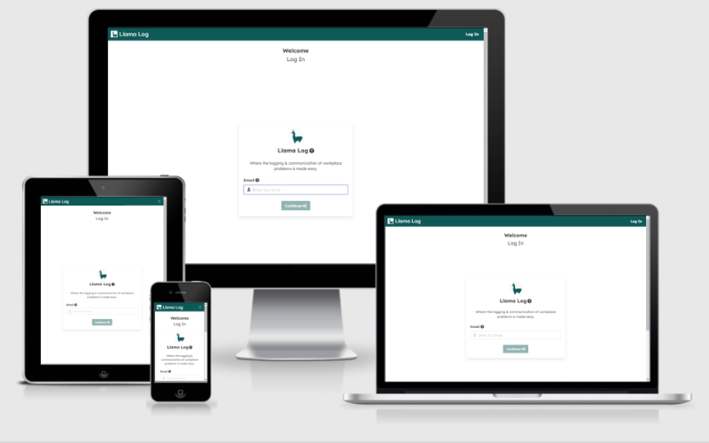

# Llama Log

Llama Log is a CRUD web application that provides colleague's the ability to keep a log of equipment work orders & staff/customer related incidents within the workplace. Llama Log's goal is to help colleague's tackle these issues, enabling them to be more productive & efficient when on shift, decreasing various costs the business may have in the long run.



[Link to deployment of Llama Log](https://llama-log.herokuapp.com/).

<hr>

## Contents

* [UX Design](#ux-design)
    + [Strategy](#strategy)
        - [The Problem](#the-problem)
        - [The Costs](#the-costs)
        - [The Solution](#the-solution)
        - [The Difference](#the-difference)
        - [User Goals](#user-goals)
        - [Business Goals](#business-goals)
        - [Opportunities](#opportunities)
    + [Scope](#scope)
        - [User Requirements](#user-requirements)
        - [User Stories](#user-stories)
        - [Current Features](#current-features)
        - [Future Features](#future-features)
    + [Structure](#structure)
        - [External Pages](#external-pages)
        - [Internal Pages](#internal-pages)
        - [Database Schema](#database-schema)
    + [Skeleton](#skeleton)
        - [Wireframes](#wireframes)
            * [Mobile](#mobile)
            * [Tablet](#tablet)
            * [Desktop](#desktop)
    + [Surface](#surface)
        - [Visual Language](#visual-language)
            * [Colour](#colour)
            * [Typography](#typography)
            * [Imagery & Identity](#imagery---identity)
* [Technology](#technology)
    + [Languages](#languages)
    + [Frameworks & Libraries](#frameworks---libraries)
    + [Applications](#applications)
* [Testing](#testing)
* [Deployment](#deployment)
    + [Deployment Procedure](#deployment-procedure)
    + [Fork this Repository](#fork-this-repository)
    + [Clone this Repository](#clone-this-repository)
* [Credits](#credits)
    + [Resources](#resources)
    + [Code](#code)
* [Acknowledgements](#acknowledgements)

<hr>

## UX Design

### Strategy

#### The Problem

In the workplace, communication can be a challenge. This can especially be the case when particular colleague's shift patterns don't collide, meaning they cannot communicate physically to one another. This can be a problematic issue concerning equipment-based work orders or incidents within the workplace, as the colleague who is aware of the work order/incident may fail to inform their fellow colleagues of it. In the future, another colleague may have to tackle the given work order/incident and due to the previous colleague not informing others of the situation, the current colleague may not be able to solve the situation in the most effective & efficient manner.

#### The Costs

This lack of communication can lead to financial costs to the business in logging multiple work orders, or reputational costs due to poor customer service, as colleagues were not better informed of a particular situation and are therefore portrayed as unprofessional in the eyes of a customer.

#### The Solution

Llama Log's goal is to improve communication between colleague's within a given work environment, allowing for better management over equipment-based work orders and incidents in the workplace.

It's goal is to act as the central hub where employee's can store information regarding particular work orders and incidents. Employee's can then refer to Llama Log whenever they may need to be fully informed of a situation that's previous occured, enabling them to act upon it effectively in the present.

#### The Difference

Communication in the workplace is a problem that's been tackled with the use of software many times, so what will make Llama Log different?

Llama Log will feature a user interface that will not assume that the user is tech-savvy. It will sport a visual language that's familiar, readable and economic to the end user, inspiring them to continue using the application which'll then aid them in achieving their work-related targets. It's design will be inspired by the social media giant [Facebook](https://www.facebook.com/), as "many marketers report that Facebook is the most effective platform for reaching an older demographic", according to ["How over 50s use social media and the internet"](https://www.digital22.com/insights/how-over-50s-use-social-media-and-the-internet) by Molly Johnston. This will aid Llama Log in being familiar to older users who are less technically inclined, increasing the likelihood that they'll repeatedly use the application.

#### User Goals

Llama Log can help employee's achieve goals such as:

- Providing outstanding customer service consistently.
- Directing visiting engineers towards the source of a equipment-related issue, fixing the issue in a timely manner.
- Communicating effectively with colleagues that they may not work with on a regular basis.

#### Business Goals

Llama Log can help businesses achieve goals such as:

- Saving money by fixing equipment on the first call and not having to make multiple calls to solve a singular issue.
- Creating a collaborative working environment for colleagues, building on their communication skills and confidence when tackling situations they're not fully informed on.
- Store data on the most common equipment faults in the workplace, allowing them to make better informed decisions when purchasing equipment in the future.
- Store data regarding the most common incidents with customers, enabling the business to create relevant learning materials for colleagues regarding such incidents.

#### Opportunities

Below is a table containing a list of opportunities that Llama Log could potentially provide:

| Opportunity/Problem                   | Importance | Feasability |
|---------------------------------------|:----------:|:-----------:|
| Register Employee (Admin)             |      5     |      4      |
| Log In (Admin & Employee)             |      5     |      4      |
| 404 Page                              |      5     |      5      |
| Create & Edit Post (Admin & Employee) |      5     |      5      |
| Comment on Post (Admin & Employee)    |      3     |      3      |
| Responsive Design                     |      3     |      4      |
| Archive Post (Employee)               |      4     |      5      |
| Delete Archived Post (Admin)          |      4     |      3      |
| Form Validation for WO's & Incidents  |      5     |      5      |
| Admin Database Queries                |      2     |      3      |
| Search previous posts                 |      4     |      4      |

Considering that enhancing the communication between colleague's is the essential goal that Llama Log is aiming for, any opportunities that do not directly contribute to this minimum goal will be postponed for a later release of Llama Log.

The opportunity that stands out here in not directly contributing to Llama Log's main goal is Admin Database Queries, which is a feature that enables admins to query data within the database of posts made by colleagues, that could suggest trends in the workplace that the business can act upon. This feature will be postponed and will therefore not make it into the MVP of Llama Log.

[Return to Contents &#8679;](#Contents)

### Scope

#### User Requirements

So what would employee's say they need from Llama Log? Employee's need to be able to input information surrounding a work order/incident quickly, so they can promptly return to a task they've currently been assigned to in the workplace. An input form shouldn't contain lots of input fields, nor should it present input fields irrelevant to the employee''s current situation, an example being a work order number input field when the employee is actually attempting to log a situation involving a customer.

The usefulness of Llama Log will be largely dependent on how quick the employee is able to create & read information. Therefore upon logging in, both pieces of functionality need to be present to the employee immediately.

Employee's will likely be reading information in the past and providing employee's are actively using the application, the amount of information will likely build up to a point so much so, that employee's will have to scroll down continuously through vast amounts of information that's irrelevant to them. This can quickly become a tedious and slow workflow, providing a bad user experience. For this reason, a search input field should be immediately present upon logging in. This will enable employee's to promptly search for the information they're looking for.

What they may not know they need however is data validation. The employee will need to insert data into all input fields within the form, in order to make the information regarding a work order/incident useful to themselves or their colleague's in the future. It's important to remember with this in mind not to overload the employee with input field's, as they may not have the time or patience to fill in every minor detail.

#### User Stories

**As an Employee using Llama Log, I'd expect to:**

- Be prompted to create a password when I first log in.
- Immediately see the live feed of posts when logging into the app.
- Quickly be able to create a new post when logging into the app.
- Be given an input form that's relevant to my current situation when creating a post.
- Quickly search for previous posts using a search field.
- Edit a post I've previously made.
- Delete posts I've previously made.

**As an Admin, I'd expect Llama Log to enable me in:**

- Creating new employee & admin user accounts.
- Deleting employee & admin user accounts.
- Editing all fields relating to an employee account (except password).
- Deleting posts that employee's have previously created.
- Deleting posts that former employee's have previously created.

**As a user of Llama Log, I'd expect to:**

- Log in to the app promptly.
- Immediately know what the app is about prior to logging in.
- Be familiar with it's design, so it's easily learnable.
- Immediately tell which information is important based on visual language alone.

#### Current Features

In order to help both employee's and businesses achieve their respective goals, Llama Log in it's MVP stage will contain the following features:

- A log in page upon first opening the application, instructing the user to log in with a brief description of the app alongside the log in form.
- A familiar home page, featuring a live feed of posts made by employee's at the center, search field at the top, user name & avatar at the top right and create new post call to action button at the top of the live feed.
- A user account management page for admins, where they're able to create, view, update or delete employee & admin accounts.
- An error page that redirects the user back to the home page containing their live feed.
- A search input field that allows the user to search though the titles and descriptions within previous posts using keywords.
- Posts that the user has created can be edited, however posts created by others cannot.
- When creating a new post, the user will decide between a work order or incident, both containing their respective input fields.
- Data validation on all input fields, to prevent missing information that could be of use and consistent look when posts are viewed.

#### Future Features

The features listed below don't directly tackle the problems Llama Log is attempting to resolve, therefore they will not make it into the MVP of Llama Log. Given that they would enhance the usability of Llama Log however, they will be implemented within a future release of the application.

- The About Us page was unfortunately exempt from making it to the initial release of Llama Log due to time contraints and not being of major importance to the application's functionality. Considering this is a major part of information current users & potential users of the features & usefulness of Llama Log, this should be integrated into Llama Log when possible.
- Add an additional "search by date" filter within the feed page.
- A database query page that allows admins to compile mass sums of data taken from posts employee's have made, which could be of use to other sectors within the business.
- Post history page, that presents the history of a post. This allows users to see previous iterations of a post if it's been edited on multiple occasions.
- A post archive, where general users are able to look at posts within the companies past and clear the current feed of potentially irrelevant posts.
- Provide functionality to add customer involved field to incident even if during creation, a customer name & phone was not provided and therefore not saved in database.

[Return to Contents &#8679;](#Contents)

### Structure

The entry point of the application should be a log in page, as this will immediately direct the user to sign in and interact with the application. This is more inline with Llama Log's goal as an application, rather than being directed to a general home page and having to make an additional button click to another page in order to sign in to the application.

An overall and visual look of the structure & page direction of Llama Log can be found below:


A more thorough walkthrough of each page can be seen below.

#### External Pages

The following pages are the only ones available whilst the user is not signed in.

<details>

<summary><strong>index.html</strong></summary>

- Navbar links
    - Logo Image - Directs user to log in page
    - Log In (Active) - Informs user they're on the log in page & reloads page when clicked.
    - About Us - Directs user to about page

- Features
    - A login form, where the user can input their user ID & password in order to gain access to Llama Log's functionality.
    - Image & brief info about the application on the left side of the form (Desktop screens only)

</details>

<details>

<summary><strong>about.html</strong></summary>

The about page will provide information regarding Llama Log, informing the user of the application's goals and how it can benefit the user's business.

The about page would only be useful to those who are not adopting Llama Log within their business, therefore this page will only be available to users who are not signed in. This will also reduce the amount of elements in the navbar, reducing the visual complexity of the app, ensuring a friendly and efficient user experience for non-tech savvy users.

- Navbar links
    - Logo Image - Directs user to the log in page
    - Log In - Directs user to the log in page
    - About Us (Active) - Informs user they're on the about page & reloads page when clicked.

</details>

#### Internal Pages

The following pages are the only ones available whilst the user is signed in.

<details>

<summary><strong>new_user.html</strong></summary>

Navbar links will be removed at this stage within the application to reduce the chance of the user entering the application without a password.

- Navbar links
    - Logo Image - Directs user to the log in page

- Features
    - Displays a form asking the user to create a new password, with the requirements of a password clearly present.
    - User must enter password twice to validate it's correct and no type errors were made.

</details>

<details>

<summary><strong>feed.html</strong></summary>

The home page will contain the live feed of posts made by themselves and other users. This page's design will be influenced by that sported by Facebook, as it's the page the user will find themselves within more often than others. This means it's important that this page features a familiar design, inspiring confidence within the user that they can operate the user interface, performing desired functions such as creating a post or finding a previous post.

- Navbar links
    - Logo Image - Directs user to the home page
    - Feed (Active) - Informs user they're on the feed page & reloads page when clicked.
    - Account - Directs user to the manage account page
    - Manage (Admin only) - Directs user to the manage page

- Features
    - At the top of the feed whilst below the navbar there will be two buttons, Search & Create Post. Both providing their respective functionalities with supporting icons that make it learnable.
    - Posts presented in a live feed at the centre of the page, sorted by time of creation. Each post will present enough information so that the user can clearly identify the topic and click view post to open it fully on an isolated page (view_post.html). Having a limit to the size of a post due to the amount of text within will maintain a readable and user-friendly UX, as posts so large can be a chore to scroll down from.
    - Posts within the live feed are also color coded, so that the posts can easily be distinguished as work orders & incidents will be given unique colors respectively. It's important however that these colors are not too vibrant & drastic, as the UI would be intense to look at resulting in a poor UX. Too many vibrant colors would also provide a playful feel to the app, which contradicts the intention of the application being used within a business context. Therefore it's important to be conservative & clinical about the choice of colors used for each category.

</details>

<details>

<summary><strong>create_post.html</strong></summary>

- Navbar links
    - Logo Image - Directs user to the home page
    - Feed - Directs user to the feed page
    - Account - Directs user to the manage account page
    - Manage (Admin only) - Directs user to the manage page

- Features
    - A header that informs the user as to where they are.
    - Page opens with two large buttons asking the user what type of post are they looking to create, work order or incident. Both category buttons featuring a less saturated shade of their respective colors, which turns to the original shade when clicked and directs the user to a create new post form that's suited to their chosen category.
    - Form validation that's immediately present to the user, rather than informing them when attempting to submit a post.

</details>

<details>

<summary><strong>view_post.html</strong></summary>

- Navbar links
    - Logo Image - Directs user to the home page
    - Feed - Directs user to the feed page
    - Account - Directs user to the manage account page
    - Manage (Admin only) - Directs user to the manage page

- Features
    - A header that informs the user as to where they are.
    - User is able to view post in isolation from other posts & view all comments underneath.
    - A colleague user is able to comment on the post their viewing, which can be their own or someone else's.
    - Provided the user is the author of the post, they are able to edit the post by clicking the edit button, directing them to edit_post.html. If they're not the author of the post, the edit button will not appear.
    - Admins are not able to edit posts that are not their own either, however they are able to archive them.

</details>

<details>

<summary><strong>edit_post.html</strong></summary>

- Navbar links
    - Logo Image - Directs user to the home page
    - Feed - Directs user to the feed page
    - Account - Directs user to the manage account page
    - Manage (Admin only) - Directs user to the manage page

- Features
    - A header that informs the user as to where they are.
    - A form presents itself to the user with all fields pre-filled with the data taken from the database.
    - User is able to edit the post in it's entirety.
    - Data validation is still immediately present, making sure the user doesn't insert incorrect information.

</details>

<details>

<summary><strong>account.html</strong></summary>

- Navbar links
    - Logo Image - Directs user to the home page
    - Feed - Directs user to the feed page
    - Account (Active) - Directs user to the manage account page
    - Manage (Admin only) - Directs user to the manage page

- Features
    - A small card presents itself to the user, presenting the user's information.
    - User is able to modify and update fields within their account.

</details>

<details>

<summary><strong>manage.html</strong></summary>

- Navbar links
    - Logo Image - Directs user to the home page
    - Feed - Directs user to the feed page
    - Account - Directs user to the manage account page
    - Manage (Admin only) (Active) - Directs user to the manage page

- Features
    - Displays list of users to admin, each user list item featuring it's respective edit & delete button.
    - Edit button for each list item directs the user to edit_user.html with that user's info pre-filled within a form ready for editing.
    - Admin is able to delete account without exiting the page. Defensive UX should be in place however, making sure the user really wants to delete the user.
    - A create new user button at the top of the list of existing user accounts, directing the user to create_user.html.


</details>

<details>

<summary><strong>create_user.html</strong></summary>

- Navbar links
    - Logo Image - Directs user to the home page
    - Feed - Directs user to the feed page
    - Account - Directs user to the manage account page
    - Manage (Admin only) (Active) - Directs user to the manage page

- Features
    - Displays a form to the admin, where they can enter a new user's information. Password is excluded from this form, as the user will get to create that themselves when entering their e-mail.
    - All fields within the form will be required, to ensure data is consistent within the database.
    - Data validation will be immediately present, creating a seamless UX and not frustrating the admin when creating a new user.

</details>

<details>

<summary><strong>edit_user.html</strong></summary>

- Navbar links
    - Logo Image - Directs user to the home page
    - Feed - Directs user to the feed page
    - Account - Directs user to the manage account page
    - Manage (Admin only) (Active) - Directs user to the manage page

- Features
    - Displays the same form as the one in create_user.html, except the form is pre-filled with user information.
    - All fields within the form will be required, to ensure data is consistent within the database.
    - Data validation will be immediately present, creating a seamless UX and not frustrating the admin when creating a new user.

</details>

#### Database Schema

The database for Llama Log will be hosted via [MongoDb](https://www.mongodb.com/) and the collections within the database are:

> Note: The ID field for each collection is the primary key & increments on each instance.

- Users
    - Contains personal & account oriented data regarding a user.
    - The admin field will contain boolean values, interactivity for the user will be restricted depending on these values.

- Incidents & Work Orders
    - Each containing a title, description & user that wrote the post (author).
    - Contains date_created field so posts could be sorted by date in feed page at a later release.
    - Incidents will contain a customer name & phone field if a customer has been involved in particular incident.
    - Work orders will contain an equipment field so a particular piece of equipment is specified within a work order.

- Comments
    - Contains the comment content itself, the author & date created.
    - The parent_post_id field has a many-to-one relationship with the _id field of incidents & work orders, as a post can have many comments, whereas a comment can only have one parent post.

The database schema is as follows:


[Return to Contents &#8679;](#Contents)

### Skeleton

#### Wireframes

##### Mobile

<details>

<summary>Index page (existing user)</summary>


</details>

<details>

<summary>Index & new password page (new user)</summary>


</details>

<details>

<summary>About page</summary>


</details>

<details>

<summary>Feed page</summary>


</details>

<details>

<summary>View post page</summary>


</details>

<details>

<summary>Create post page</summary>


</details>

<details>

<summary>Edit post page</summary>


</details>

<details>

<summary>View account page</summary>


</details>

<details>

<summary>Manage Users page</summary>


</details>

<details>

<summary>Create & edit users pages</summary>


</details>

##### Tablet

<details>

<summary>Index page (existing user)</summary>


</details>

<details>

<summary>Index & new password page (new user)</summary>


</details>

<details>

<summary>About page</summary>


</details>

<details>

<summary>Feed page</summary>


</details>

<details>

<summary>View post page</summary>


</details>

<details>

<summary>Create post page</summary>


</details>

<details>

<summary>Edit post page</summary>


</details>

<details>

<summary>View account page</summary>


</details>

<details>

<summary>Manage Users page</summary>


</details>

<details>

<summary>Create & edit users pages</summary>


</details>

##### Desktop

<details>

<summary>Index page (existing user)</summary>


</details>

<details>

<summary>Index & new password page (new user)</summary>


</details>

<details>

<summary>About page</summary>


</details>

<details>

<summary>Feed page</summary>


</details>

<details>

<summary>View post page</summary>


</details>

<details>

<summary>Create post page</summary>


</details>

<details>

<summary>Edit post page</summary>


</details>

<details>

<summary>View account page</summary>


</details>

<details>

<summary>Manage Users page</summary>


</details>

<details>

<summary>Create & edit users pages</summary>


</details>

[Return to Contents &#8679;](#Contents)

### Surface

#### Visual Language

A visual language should be created & utilised within Llama Log, to convey information to the user without having to tell them the information. Making this language simple makes it learnable to the user and de-clutters the page, making the overall UX more user friendly.

##### Colour

Considering the target audience, Llama Log requires a conservative approach to the colour scheme to provide it with a professional appearance.

The chosen primary colour for Llama Log is mix between green and blue, darkened enough to conform to WCAG guidelines. Given green's association with emotion's such as [safety & optimism](https://www.verywellmind.com/color-psychology-green-2795817) and blue's association with [stability & productivity](https://www.verywellmind.com/the-color-psychology-of-blue-2795815), this felt like a good metaphorical fit when taking Llama Log's goals into account.

Experimenting with [Coolors](https://coolors.co/), I came up with the following colour scheme:

- Primary: hsl(178, 75, 20)
- Black: hsl(0, 0, 12)
- White: hsl(0, 0, 98)


The colours within the colour scheme all follow WCAG web accessibility guidelines as shown below:

<details>

<summary>Show contrast checker results</summary>


</details>

##### Typography

Keeping with the conservative approach previously mentioned during the development process of this plane, Llama Log should only sport one font family. However this font family will have multiple bold variances, providing us with the ability to inform the user on the importance of content based on it's boldness, improving the visual language of the application.

The font family chosen for Llama Log is [Lexend](https://fonts.google.com/specimen/Lexend?preview.text=Llama%20Log&preview.text_type=custom&query=lexend) which was created for reading proficiency purposes, tackling visual stress, helping those with dyslexia & others that struggle with reading. 


Utilising this font family along with the chosen colour scheme will aid Llama Log in being as visually accessibile as possible.

##### Imagery & Identity

It's important that Llama Log is consistent with it's imagery, as it forms a part of it's identity & overall brand to those interested in or using it. A logo is therefore important for this reason.

An obvious approach is taking inspiration from Facebook's logo, however this would come across fairly obvious to end users and it might negatively impact initial impressions given to end users.

I decided to look into animal characteristics that relate to my application and it's goals. The chosen animal was the Llama, due to it's reputation in being a guardian for livestock animals such as sheep & chickens. This metaphorically relates to the application in how it aims to protect it's users from problematic situations within the workplace. Adding log to the end of the animal name helps wrap it all together, hence Llama Log.

Combining the colour scheme, typography & identity of Llama Log, the logo will be as follows:


[Return to Contents &#8679;](#Contents)

<hr>

## Technology

### Languages

- HTML5
- CSS
- JavaScript
- Python

### Frameworks & Libraries

- [Flask](https://flask.palletsprojects.com/en/2.0.x/)
- [Bulma.io](https://bulma.io/)
- [Google Fonts](https://fonts.google.com/)
- [Font Awesome](https://fontawesome.com/)
- [PyMongo](https://flask-pymongo.readthedocs.io/en/latest/)
- [Animate.css](https://animate.style/)
- [tippy.js](https://atomiks.github.io/tippyjs/)
- [clamp.js](https://github.com/josephschmitt/Clamp.js/)

### Applications

The following applications were utilised during the development of Llama Log:

- [Affinity Designer](https://affinity.serif.com/en-gb/designer/)
    - Affinity Designer was used to create the logo for Llama Log and export screenshots into PNG files that appear throughou the markdown files within this repo.

- [Balsamiq](https://balsamiq.com/)
    - Balsamiq was utilised to create the wireframes during the skeleton plane UX development phase of Llama Log.

- [Tables Generator](https://www.tablesgenerator.com/markdown_tables)
    - Tables generator was utilised to quickly create tables within this README markdown file.

- [dbdiagram.io](https://dbdiagram.io/home)
    - dbdiagram was utilised to create entity relationship diagrams in order to clearly visualize the database structure of Llama Log & the relationship contained within it.

- [Real Favicon Generator](https://realfavicongenerator.net/)
    -  Real Favicon Generator was used to create the favicon used for this application.

- [Heroku](https://www.heroku.com)
    - Heroku was used as a deployment platform for Llama Log. This allows user's to view a live & deployed version of Llama Log.

- [MongoDB Atlas](https://www.mongodb.com)
    - MongoDB Atlas was used as a database platform to store data utilised by Llama Log.

- [GitPod](https://www.gitpod.io/)
    - GitPod was utilised as a the IDE for Llama Log.

- [Am I Responsive?](http://ami.responsivedesign.is/)
    - Am I Responsive was utilised in order to capture an image of the Llama Log front page on multiple screens at once.

- [GitHub](https://github.com/)
    - GitHub was used as a version control platform.

- [Regexr](https://regexr.com/)
    - Regexr was utilised to test regular expressions utilised by Llama Log.

- [GitHub Wiki TOC generator](https://ecotrust-canada.github.io/markdown-toc/)
    - This table of contents generator was used to create a table of contents for this README.md and the TESING.md file.

- [W3C's Markup Validation Service](https://validator.w3.org/)
    - The W3C's HTML Markup Validation Service was utilised as a validator for the HTML files within this application.

- [W3C's CSS Validation Service](https://jigsaw.w3.org/css-validator/)
    - The W3C's CSS Validation Service was utilised as a validator for the CSS files within this application.

- [JSHint](https://jshint.com/)
    - JSHint was utilised as a validator for the JavaScript files within this application.

- [PEP8 online](http://pep8online.com/)
    - PEP8 Online was utilised as a validator for the Python files within this application.

- [Lighthouse](https://developers.google.com/web/tools/lighthouse)
    - Google Chrome's in-built Lighthouse tool was utilised to test the accessibility of Llama Log.

- [LambdaTest](https://www.lambdatest.com/)
    - LambdaTest was utilised to test how the application looks & works on Safari whilst on a windows laptop.

[Return to Contents &#8679;](#Contents)

<hr>

## Testing

To navigate to the testing section of this repository, [click here](TESTING.md).

[Return to Contents &#8679;](#Contents)

<hr>

## Deployment

Considering this project features back-end technology, a GitHub pages would not be a suitable option in regards to hosting the project online. Due to this, [Heroku](https://www.heroku.com) was utilised as it's an online platform that supports the back-end technologies which are listed within the [technology heading](#Technology).

### Deployment Procedure

The deployment procedure was as follows:

1. Create a requirements file, requirements.txt is the industry standard naming convention for this file. Use the <code>pip3 freeze --local > {filename}</code> command to create this file, insert the dependencies your application requires within it and store it within your current repository.
    ```
    pip3 freeze --local > requirements.txt
    ```

2. Create a procfile, this file informs Heroku as to what processes should be executed when opening the application. This file should be simply named "Procfile" and nothing else, as Heroku will be looking for a file simply named "Procfile. Use the <code>Echo</code> git command to insert "web: python app.py" into a file named "Procfile".
    ```
    git echo web: python app.py > Procfile
    ```

3. <code>git commit</code> & </code><code>git push</code> these files into a chosen GitHub repository. Heroku will access your application from this remote repository, not the repository stored within your local machine.

4. Log in to Heroku and create a new app by clicking the "New" button on the top right within your personal Heroku dashboard & selecting "Create New App".

5. Give your new Heroku app a name that's unique, select the region you're within and click "Create App".

6. Click Deploy and within the deployment method section, select GitHub.

7. Assuming you're signed in with your GitHub account, search for the remote repository you recently created that holds the Procfile & requirements text file and connect to it using the "Connect" button. Once connected, it's important to not click "Enable Automatic Deploys" at this time. This is due to the fact that we have not setup any environment variables, which is what we'll do next.

8. To add environment variables, first click the "Settings" tab within the horizontal tab menu and navigate to the "Config Vars" section of this tab. Click the "Config Vars" button and you will see input fields ready to store your environment variables. Here you can insert your variable keys with their values as such:
    ```
    IP - "0.0.0.0"
    PORT - "5000"
    SECRET_KEY - <your unique & secret key>
    MONGO_URI - <your unique MongoDB URI string>
    MONGO_DBNAME - <your unique MongoDB database name>
    ```

9. Once you're environment variables are stored, head back to the "Deploy" tab and click the "Enable Automatic Deploys" button that I previously mentioned.

10. Once Enable Automatic Deploys is enabled, you can then click "Deploy Branch" ensuring that the branch selected in the dropdown is the one you want to deploy to Heroku.

11. Once deployed, Heroku will inform you that it has been successfully deployed and from here you can view the app by selecting the "Open App" button located within the top right of the page.


### Fork this Repository

Forking this repository allows you to have your personal copy of this repository, enabling you to make your own changes to the application and not change the original repository in the process.

To fork this GitHub repository, do as follows:

1. Ensure you're logged in to GitHub and navigate to [this repository](https://github.com/KieranSweeden/llama-log).

2. At the top right of the repository, you'll find a "Fork" button which is between the "Unwatch" & "Star" button. Click the "Fork" button.

3. You should now have your own copy of this repository within your GitHub account.

### Clone this Repository

Cloning a repository provides benefits similar to Forking, however cloning is most often utilised when attempting to create a copy of a repository within a local machine. 

To clone this GitHub repository (or your previously forked copy), do as follows:

1. Ensure you're logged in to GitHub and navigate to [this repository](https://github.com/KieranSweeden/llama-log) or your own forked copy of this repository.

2. Click the "Code" dropdown button which is located above where the README is presented and press the copy to clipboard button (or highlight & copy/paste the URL provided). At this point make sure HTTPS is selected (it should be as it's the default setting).

3. Open the terminal within your IDE, ensuring it's a Git Bash terminal and that the current location in which you're at is the location you'd like to store your personal copy of the repository.

4. Within the terminal, type the <code>Git clone</code> command alongside the url you recently copied to clipboard. The command should look like such (provided the URL you copied is this repo and not your forked copy):
    ```
    git clone https://github.com/KieranSweeden/llama-log.git
    ```

5. Press enter and you should notice processes being made within the terminal informing you that the repo is being cloned. Once this is done, you should notice the files and folders appear within your IDE project.

> The next few steps assume you already have a MongoDB account containing a cluster & database. If you have not got an account or have not set up a cluster/database, look at [Get Started with Atlas](https://docs.atlas.mongodb.com/getting-started/) to get you up and running.

6. Use the <code>git touch</code> within the terminal to create an <code>env.py</code>. Within this file you will store the environment variables. The code within the <code>env.py</code> file should look as follows (with the bracketed variables being replaced by your own variables):
    ```
    import os

    # Server related variables
    os.environ.setdefault("IP", "0.0.0.0")
    os.environ.setdefault("PORT", "5000")

    # Secret key variable
    os.environ.setdefault("SECRET_KEY", {Your unique secret key})

    # MongoDB related variables
    os.environ.setdefault("MONGO_URI", {Your unique mongo URI})
    os.environ.setdefault("MONGO_DBNAME", {Your unique mongo database})
    ```
> It's important at this stage that the env.py is listed within your .gitignore file, otherwise the sensitive information will be publicly avialable. 

7. From here we can now install the libraries & packages that Llama Log depends on. We do this by typing in the following:
    ```
    pip3 install -r requirements.txt
    ```

8. After pressing enter, you should see that the libaries & packages are being installed and you will be informed when this is completed.

9. Once the dependencies have been installed, you can run the app by typing in the following within the terminal:
    ```
    python3 app.py
    ```
> To view the application, you should enter [https://0.0.0.0:5000/](https://0.0.0.0:5000/) within the URL field of your chosen browser (assuming 0.0.0.0 is your IP variable and 5000 is your port variable).

[Return to Contents &#8679;](#Contents)

<hr>

## Credits

### Resources

- [Flask: current page in request variable](https://newbedev.com/flask-current-page-in-request-variable)
    - This post informed me of what syntax to use in order to add active classes to navbar items that reflect the current page.

- [3 Ways to Convert String to Dictionary in Python](https://favtutor.com/blogs/string-to-dict-python)
    - This article was where I found out how to use the ast.literal.eval() method, which converts strings to dictionaries.

- [The HTML5 progress Element](https://css-tricks.com/html5-progress-element/)
    - This CSS Tricks article was tremendously helpful in understanding how to style the progress bar for various browsers.

- [Add a property to a JavaScript object using a variable as the name?](https://stackoverflow.com/questions/695050/add-a-property-to-a-javascript-object-using-a-variable-as-the-name)
    - No code was directly taken from this source, however the idea concept [found here](https://stackoverflow.com/a/695053/15607265) proved to be useful in finding a way to add a tooltip for the edit user title.

- [Flask Tutorials](https://www.youtube.com/playlist?list=PLzMcBGfZo4-n4vJJybUVV3Un_NFS5EOgX)
    - This playlist of video's were really useful in furthering my understanding of how Flask works and how to deploy it using Heroku. Despite finding the Code Institute course material useful, seeing another programmer's take on the framework gave additional context and furthered my understanding of it.
    - This playlist also introduced me to concept of Blueprint's within Flask, that weren't present within the Code Institute materal. I found this to be useful as I was able to seperate files based on how they related to one another.

- [Form Validation Part II - JS and the Constraint Validation API Video](https://www.youtube.com/watch?v=D9JHizCAx8U)
    - This video by [Steve Griffith](https://www.youtube.com/channel/UCTBGXCJHORQjivtgtMsmkAQ) was really useful as it simplified the Constraint Validation API. This made me comfortable in using the API and motivated me to further my understanding by looking at the MDN Web Docs webpages regarding it.

- [The backslash is redundant between brackets (E502)](https://www.flake8rules.com/rules/E502.html)
    -  This provided great use as during the testing procedures, I encountered an issue where pep8 wanted lines less than 80 characters without backslashes due to redundancy. Using the method provided below, I was able to fix the minor issue.

- [Flask Documentation](https://flask.palletsprojects.com/en/2.0.x/)
    - Flask's own documentation was particularly useful in furthering my understanding of using methods within HTML templates using Jinja's syntax.

- [MDN Web Docs](https://developer.mozilla.org/en-US/)
    - MDN Web Docs were very useful in providing plenty of examples in how to use data structures & methods unique to them, which helped solve many problems I had with Llama Log.
    - Particularly their [selection of pages targetting the Contraint Validation API](https://developer.mozilla.org/en-US/docs/Web/API/Constraint_validation) were really useful in understanding how validation works within forms.

- [Stack Overflow](https://stackoverflow.com/)
    - Stack Overflow was tremendously useful in finding solutions to the problems I was having during the developement of Llama Log. Although a lot of the solutions provided weren't directly implemented within Llama Log, their general philosophy in tackling the problem aided in me in providing solutions to my own problems during the developement of Llama Log.

- [W3Schools](https://www.w3schools.com/)
    - W3Schools was exceptionally useful during moments where I was attempting to further my understanding of functionality within Python. Their pages regarding the PyMongo library were especially most useful, as they have pages soley dedicated to each of the CRUD functions utilised within PyMongo.
    - They were also very useful in explaining Python & Javascipt syntax in a simple manner, during times where I was attempting to further my understanding of core concepts within each language to tackle particular problems with Llama Log.

### Code

- [Clamp.js](https://github.com/josephschmitt/Clamp.js)
    - All code within the clamp.min.js file is credited to [Joe Schmitt](https://github.com/josephschmitt) & [Ned Baldessin](https://github.com/nedbaldessin). This code was used so large amounts of text within the posts would be cutoff at a certain point, making sure the user is not overwhelmed with lots of text they may not be interested in.

- [Name Regular Expression Pattern](https://stackoverflow.com/a/46665046/15607265)
    - The regex pattern used to validate the user's name input was taken from Wiktor's answer to [this Stack Overflow question](https://stackoverflow.com/a/46665046/15607265).

- [CSS Progress Bar code](https://codepen.io/AKGD/pen/Bmxpdb)
    - The code to allow bulma progress bar transitions was taken from [this CodePen project](https://codepen.io/AKGD/pen/Bmxpdb).

- [Push cursor to end of input value when focusing](https://stackoverflow.com/a/2345915/15607265)
    - The code to place the cursor at the end of an input's value when auto-focusing was taking from [this Stack Overflow answer](https://stackoverflow.com/a/2345915/15607265).

[Return to Contents &#8679;](#Contents)

<hr>

## Acknowledgements

I'd like to thank:

- Code Institute for the course content and the support throughout.
- My mentor Sammy Dartnall for being supportive, enthusiastic & a tremendous helping hand throughout the development of this project.

[Return to Contents &#8679;](#Contents)

<hr>